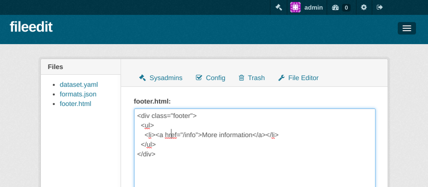

# ckanext-fileedit

A minimal text editor for CKAN sysadmins



ckanext-fileedit lets you edit text files through the
CKAN Admin interface. You can provide a function to
validate file contents before they are saved, e.g. to
make sure a JSON or template file is valid. You can
also provide a function to run after the file was saved
successfully, e.g. to restart the web server or clear
a cache.

## Minimal config

```ini
ckan.plugins = ... file_edit

file_edit.editable_files = [{"path": "/path/to/my/file"}]
```

## Full config

```ini
ckan.plugins = ... file_edit

file_edit.editable_files = [
  {
    "path": "/path/to/my/file",
    "label": "My File",
    "validate": "ckanext.mytheme.validators:file_validator",
    "after_update": "ckanext.mytheme.tasks:notify_owner"
  },
  {
    "path": "/path/to/another_file"
  }]
```

Indentation on the left is required for the ini parser to pass the
complete JSON `editable_files` value

